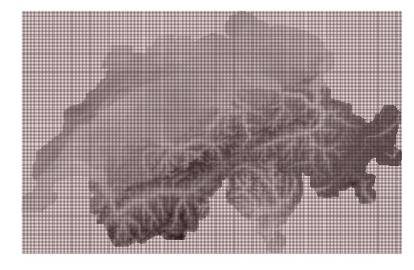
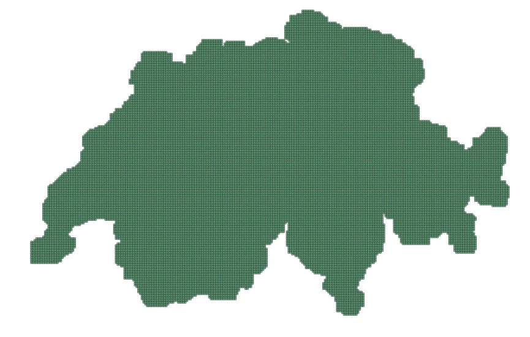

# Swiss Earth Observation Data Infrastructure (Swiss-EODI)

## :ledger: Index

- [Grid creation](#grid-creation) 
- [Sentinel-2](#Sentinel-2)
- [MeteoSuisse](#MeteoSuisse)
- [SwissImage](#SwissImage)
- [Data status](#Data-status)

<a name="grid-creation"></a>
## 1. Grid creation

The data is saved on the EPSG:32632 grid. The pixels align to those of the Sentinel-2 satellite data in the UTM zone 32. The extent of the grid is defined by the bounding box of the MeteoSuisse data, which extends slightly beyond the administrative borders of Switzerland. 

The grid has a resolution of 1280m x 1280m, meaning 128x128 Sentinel-2 pixels (10m resolution) are included per grid cell. To create the grid, run the QGIS model in `grid_creator.model3` in QGIS. The inputs are:
- a weather file from MeteoSuisse (e.g.`O:/Data-Raw/27_Natural_Resources-RE/99_Meteo_Public/MeteoSwiss_netCDF/__griddedData/lv95updated/TminY_ch01r.swiss.lv95_202301010000_202301010000.nc`)
- an image from the Sentinel-2 tile T32TPS (e.g.`~/mnt/eo-nas1/data/satellite/sentinel2/CH/2020/S2A_MSIL2A_20200228T101021_N0214_R022_T32TPS_20200228T114852.SAFE/GRANULE/L2A_T32TPS_A024472_20200228T101400/IMG_DATA/R10m/T32TPS_20200228T101021_B03_10m.jp2`)

The resulting grid will start at the first pixel of T32TPS covering the weather file. This corresponds to the eastern most point of the data. The grid is then extended to cover the entire weather file. It is provided at the following path:
```
~/mnt/eo-nas1/eoa-share/projects/012_EO_dataInfrastructure/Project layers/gridface_s2tiles.shp
```

<p align="center">
  
</p>
<p align="center">
    <em>Sentinel-2 aligned grid covering the bounding box of MeteoSuisse file (shown in background)</em>
</p>


Since this grid is a rectangle and contains multiple tiles outside of Switzerland, it is cropped such as to keep only the grid cells that fall over the MeteoSuisse file:
```
python crop_grid.py
```

The final grid is saved at
```
~/mnt/eo-nas1/eoa-share/projects/012_EO_dataInfrastructure/Project layers/gridface_s2tiles_CH.shp
```

<p align="center">
  
</p>
<p align="center">
    <em>Sentinel-2 aligned grid cropped to MeteoSuisse file</em>
</p>

<a name="Sentinel-2"></a>
## 2. Sentinel-2 

The Sentinel-2 data is downloaded using the grid created above. Each grid tile is 1280m x 1280m, containing 128 x 128 pixels with a resolution of 10m.\
For each grid tile, the data is queried using the [minicuber](https://github.com/EOA-team/minicuber/tree/main) code which takes care of reprojecting all data to a common, 10m resolution pixel size and aligned to the coordinates of the grid (EPSG:32632). Details on other processing steps are included in the minicuber documentation.

To download the data:
```
python S2/download_pipeline.py
```

- More about interrupting and restarting the download

Multiple grid tiles can be queried together (up to 4x4) and are split back to single tiles upon data saving. The returned data cube includes the following bands and variables:
```
- "S2_AOT", "S2_B01", "S2_B02", "S2_B03", "S2_B04", "S2_B05", "S2_B06", "S2_B07", "S2_B08", "S2_B8A", "S2_B09", "S2_B11", "S2_B12", "S2_WVP", "s2_SCL", "S2_mask"
- "product_uri", "mean_sensor_zenith", "mean_sensor_azimuth", "mean_solar_zenith", "mean_solar_azimuth"
```

The data is saved year by year in a `zarr` store (https://zarr.readthedocs.io/en/stable/index.html) with the following name system:
```
S2_minx_maxy_startyeastartmonthstartday_endyearendmonthendday.zarr
```
where (minx, maxy) will correspond to the upper left coordinate of the grid tile. There are two chunks per zarr file, where the data has been split in hald along the longitude dimension.

<a name="MeteoSuisse"></a>
## 3. MeteoSuisse

<a name="SwissImage"></a>
## 4. SwissImage (Swisstopo)
### Downloading raw data

To download the dataset provided by Swisstopo (TIF files) run
```
python SwissImage/si_download.py --urls_path path/to/urls.csv --downloads_path path/to/output/folder
```

The URLS for download are provided in `ch.swisstopo.swissimage-dop10-DOp5jXFT.csv` (0.1m resolution) and `ch.swisstopo.swissimage-dop10-vWuyN4vG.csv` (2m resolution).\
The data is stored in `~/mnt/eo-nas1/data/swisstopo/SwissImage_10cm` and `~/mnt/eo-nas1/data/swisstopo/SwissImage_2m` respectively.

The TIF files store RGB values, for a 1km x 1km area. The data is in EPSG:2056 and the filenames follow the structure\
`swissimage-dop10_YEAR_MINX_MINY_RESOLUTION_2056.tif`\
MINX and MINY correspond to the coordinates of the bottom left corner of the file, in kms (EPSG:2056). The resolution is provided at 10cm (0.1m) but also 2m,
with cubic resampling done by Swisstopo.

For more information on the products please visit [here](https://www.swisstopo.admin.ch/en/orthoimage-swissimage-10)

### Fomratting to custom grid

The data was then reprojected to EPSG:32632 and resampled to be aligned to the Sentinel-2 grid:

<a name="Data-status"></a>
## Data status

The download history is tracked here:

| Date | Jobs | Notes | 
| --------- | ------------ | ------------ |
| 31.05.2024| Run S2 downloading | Package versions: sen2nbar==2023.8.1  minicuber ([commit version](https://github.com/EOA-team/minicuber/tree/14eb81ee93f91c0076e21debf23e4a82e6d7cc9e))| 
| 18.07.2024| Completed S2 download | | 
| 26.07.2024| Downloaded SwissImage 2m | | 
| 29.07.2024| Downloaded SwissImage 0.1m | | 


### Overview of data storage structure
```
 📁 \\eo-nas1\data
  ├── satellite
  │   └── sentinel2
  │       └── raw
  │           └── CH
  │   
  ├── swisstopo
  │   ├── raw
  │   │   ├── SwissImage_10cm
  │   │   └── SwissImage_2m
  │   └── cubes
  │       ├── SwissImage_10cm
  │       └── SwissImage_2m
  │
  └── meteo
```


