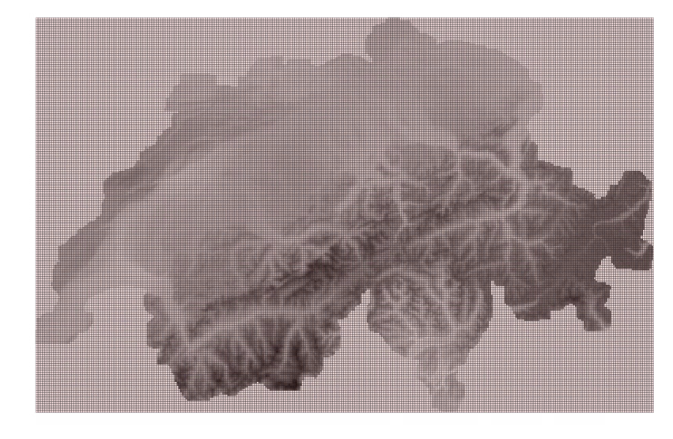
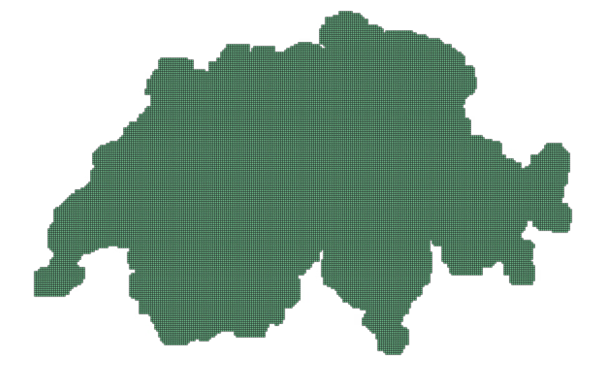

# Swiss Earth Observation Data Infrastructure (Swiss-EODI)

## :ledger: Index

- [Grid creation](#grid-creation) 
- [Sentinel-2](#Sentinel-2)
- [MeteoSuisse](#MeteoSuisse)
- [SwissImage](#SwissImage)
- [swissalti3D](#swissalti3d)
- [Landsat](#landsat)
- [DLR Soilsuite](#dlr)
- [PlanetLabs](#planet)
- [Data status](#Data-status)

<a name="grid-creation"></a>
## 1. Grid creation

The data is saved on the EPSG:32632 grid. The pixels align to those of the Sentinel-2 satellite data in the UTM zone 32. The extent of the grid is defined by the bounding box of the MeteoSuisse data, which extends slightly beyond the administrative borders of Switzerland. 

The grid has a resolution of 1280m x 1280m, meaning 128x128 Sentinel-2 pixels (10m resolution) are included per grid cell. To create the grid, run the QGIS model in `grid_creator.model3` in QGIS. The inputs are:
- a weather file from MeteoSuisse (e.g.`O:/Data-Raw/27_Natural_Resources-RE/99_Meteo_Public/MeteoSwiss_netCDF/__griddedData/lv95updated/TminY_ch01r.swiss.lv95_202301010000_202301010000.nc`)
- an image from the Sentinel-2 tile T32TPS (e.g.`~/mnt/eo-nas1/data/satellite/sentinel2/CH_old/2020/S2A_MSIL2A_20200228T101021_N0214_R022_T32TPS_20200228T114852.SAFE/GRANULE/L2A_T32TPS_A024472_20200228T101400/IMG_DATA/R10m/T32TPS_20200228T101021_B03_10m.jp2`)

The resulting grid will start at the first pixel of T32TPS covering the weather file. This corresponds to the eastern most point of the data. The grid is then extended to cover the entire weather file. It is provided at the following path:
```
~/mnt/eo-nas1/eoa-share/projects/012_EO_dataInfrastructure/Project layers/gridface_s2tiles.shp
```

<p align="center">
  
</p>
<p align="center">
    <em>Sentinel-2 aligned grid covering the bounding box of MeteoSuisse file (shown in background)</em>
</p>


Since this grid is a rectangle and contains multiple tiles outside of Switzerland, it is cropped such as to keep only the grid cells that fall over the MeteoSuisse file:
```
python crop_grid.py
```

The final grid is saved at
```
~/mnt/eo-nas1/eoa-share/projects/012_EO_dataInfrastructure/Project layers/gridface_s2tiles_CH.shp
```

<p align="center">
  
</p>
<p align="center">
    <em>Sentinel-2 aligned grid cropped to MeteoSuisse file</em>
</p>

<a name="Sentinel-2"></a>
## 2. Sentinel-2 

The Sentinel-2 data is downloaded using the grid created above. Each grid tile is 1280m x 1280m, containing 128 x 128 pixels with a resolution of 10m.\
For each grid tile, the data is queried using the [minicuber](https://github.com/EOA-team/minicuber/tree/main) code which takes care of reprojecting all data to a common, 10m resolution pixel size and aligned to the coordinates of the grid (EPSG:32632). Details on other processing steps are included in the minicuber documentation.

To download the data:
```
python S2/download_pipeline.py
```

- More about interrupting and restarting the download

Multiple grid tiles can be queried together (up to 4x4) and are split back to single tiles upon data saving. The returned data cube includes the following bands and variables:
```
- "S2_AOT", "S2_B01", "S2_B02", "S2_B03", "S2_B04", "S2_B05", "S2_B06", "S2_B07", "S2_B08", "S2_B8A", "S2_B09", "S2_B11", "S2_B12", "S2_WVP", "s2_SCL", "S2_mask"
- "product_uri", "mean_sensor_zenith", "mean_sensor_azimuth", "mean_solar_zenith", "mean_solar_azimuth"
```

### Data location and format
You may find the data in `~/mnt/eo-nas1/data/satellite/sentinel2/raw/CH`
The data is saved year by year in a `zarr` store (https://zarr.readthedocs.io/en/stable/index.html) with the following name system:
```
S2_minx_maxy_startyeastartmonthstartday_endyearendmonthendday.zarr
```
where (minx, maxy) will correspond to the upper left coordinate of the grid tile. There are two chunks per zarr file, where the data has been split in half along the longitude dimension.

<a name="MeteoSuisse"></a>
## 3. MeteoSuisse

The original data are netCDF files stored at
```
O:/Data-Raw/27_Natural_Resources-RE/99_Meteo_Public/MeteoSwiss_netCDF/__griddedData/lv95updated/```
```

The daily variables were processed by reprojecting the data to EPSG:32632 and regridding the 1km data to 10m resolution (nearest-neighbor interpolation) aligned to Sentinel-2 pixels.\
### Data location and format
You may find the data in `~/mnt/eo-nas1/data/meteo/`\
The files are named `<datavar>/MeteoSwiss_<datavar>D_<minx>_<maxx>_<year>0101_<year>1231.zarr`

The data variables are Rhires (daily precipitation [mm]), Srel (daily relative sunshine duraiton [%]), Tabs (daily mean air temprature [°C]), Tmin (daily min air temperature [°C]), Tmax (daily max temperature [°C]). For more information about the raw data please consult: https://www.meteoswiss.admin.ch/dam/jcr:215c313a-dc13-4b67-bca0-dbd966597f9a/ProdDoc_Cover-dfie.pdf.


<a name="SwissImage"></a>
## 4. SwissImage (Swisstopo)
### Downloading raw data

To download the dataset provided by Swisstopo (TIF files) run
```
python SwissImage/si_download.py --urls_path path/to/urls.csv --downloads_path path/to/output/folder
```

The URLS for download are provided in `ch.swisstopo.swissimage-dop10-DOp5jXFT.csv` (0.1m resolution) and `ch.swisstopo.swissimage-dop10-vWuyN4vG.csv` (2m resolution).\

The original TIF files store RGB values, for a 1km x 1km area. The data is in EPSG:2056 and the filenames follow the structure\
`swissimage-dop10_YEAR_MINX_MINY_RESOLUTION_2056.tif`\.
MINX and MINY correspond to the coordinates of the bottom left corner of the file, in kms (EPSG:2056). The resolution is provided at 10cm (0.1m) but also 2m,
with cubic resampling done by Swisstopo. They are stored in `~/mnt/eo-nas1/data/swisstopo/SwissImage/raw/10cm` and `~/mnt/eo-nas1/data/swisstopo/SwissImage/raw/2m` respectively.

For more information on the products please visit [here](https://www.swisstopo.admin.ch/en/orthoimage-swissimage-10)

### Fomratting to custom grid

The data was then reprojected to EPSG:32632 and resampled to be aligned to the Sentinel-2 grid (keeping a 10cm or 2m resolution).

### Data location and format
You may find the data in `~/mnt/eo-nas1/data/swisstopo/SwissImage/cubes/10cm` or `~/mnt/eo-nas1/data/swisstopo/SwissImage/cubes/2m`.\

<a name="swissalti3D"></a>
## 5. swissalti3D (Swisstopo)

A Digital Elevation Model (DEM) of Switzerland at 2m resolution produced by swisstopo was added to the dataset. The product was reprojected from EPSG:2056 to EPSG:32632 and resampled using nearest inteprolation to align to the custom grid (i.e. align to Sentinel-2 pixels).
### Data location and format
You may find the data in `~/mnt/eo-nas1/data/swisstopo/DEM`\
The files are named `sa3D_MINX_MAXY.zarr` where MINX and MINY correspond to the coordinates of the top left corner of the file, in meters (EPSG:32632).

For more information on swissalti3D please visit [here](https://www.swisstopo.admin.ch/en/height-model-swissalti3d)


<a name="landsat"></a>
## 6. Landsat 

Landsat data is downloaded on a different grid than Sentinel-2 due to different resolution and alignment. S2 pixels occur every 10m while Landsat is every 30m, meaning that S2 cubes aligned to Landsat could be created by restructuring the S2 data.

### Grid creation
We use as reference to start the grid creation the upper left corner of a Landsat tile (path 195, row 27 - one of the main tiles covering Switzerland and already in EPSG:32632). This coordinate was extracted from metadata. 

A grid extending from this coordinate and covering the extent of the weather data is produced. The tiles have the size 3840m x 3840m, corresponding to 128 x 128 pixels, and the coordinates are in EPSG:32632. We then cropped to keep only grid tiles covering Switzerland.

```
python landsat_grid.py # create rectangle grid starting from coord and extneding over bounds of weather file
python crop_grid.py # keep only geometries/tiles that cover Switzerland
```

The shapefile containing the grid tiles for Landsat is stored at
```
~/mnt/eo-nas1/eoa-share/projects/012_EO_dataInfrastructure/Project layers/grid_landsat_CH.shp
```
### Data location and format
You may find the data in `~/mnt/eo-nas1/data/satellite/landsat/raw/CH/45` and `~/mnt/eo-nas1/data/satellite/landsat/raw/CH/89` for Landsat 4-5 and Landsat 8-9 respectively. Landsat 4-5 covers 1982-2012, Landsat 8-9 covers 2013-present.

The data is saved year by year in a `zarr` store (https://zarr.readthedocs.io/en/stable/index.html) with the following name system:
```
LS_minx_maxy_startyeastartmonthstartday_endyearendmonthendday.zarr
```
where (minx, maxy) will correspond to the upper left coordinate of the grid tile. There are two chunks per zarr file, where the data has been split in half along the longitude dimension.

When the raw data is provided in EPSG:32631, it has been reprojected to EPSG:32632. Each data vraible has its own metadata with a description, scale and offset values to convert the data to reflectance and the fill value for missing data. 

The available variables are:
- Landsat 4-5: TM_B1 (blue), TM_B2 (green), TM_B3 (red), TM_B4 (nir), TM_B5 (swir1), TM_B6 (surface temp, lwir), TM_B7 (swir2), SR_ATMOS_OPACITY (atmospheric opacity)
- Landsat 8-9: OLI_B1 (coastal aerosol), OLI_B2 (blue), OLI_B3 (green), OLI_B4 (red), OLI_B5 (nir), OLI_B6 (swir1), OLI_B7 (swir2), TIRS_B10 (surface temp, lwir11)

For more information on the bands refer to: https://www.usgs.gov/faqs/what-are-band-designations-landsat-satellites

In addition to these bands there is also:
- "Quality Assessment" bitmasks: ST_QA, QA_RADSAT, QA_PIXEL, QA_AEROSOL, SR_CLOUD_QA 
- Surface temperature: ST_ATRAN (atmospheric transmissivity), ST_DRAD (downwell radiance), ST_TRAD (thermal radiance), ST_URAD (upwell radiance), ST_EMIS (emissivity), ST_EMSD (emissitivity stdev), ST_CDIST (cloud distance)
- Metadata such as scene id, original projetion, orbit path and row...

## 8. DLR soilsuite <a name="dlr"></a>

The bare soil composite produced by DLR wsa downlaoded and also processed to data cubes. It is a 5 year composite (2018-2022) produced from Sentinel-2 (for more info: https://geoservice.dlr.de/web/datasets/soilsuite_eur_5y).

The raw TIF files were downloaded with 
```
python download_src.py
```
and then the data was processed (reprojected to EPSG:32632, chunked, saved to zarr files) with 
```
python SRC_to_cube.py
```

The data is saved at `~/mnt/eo-nas1/data/satellite/sentinel2/DLR_soilsuite`, where each data file is named `SRC_<left>_<top>.zarr` indicating the top left corner of the grid used to download the Sentinel-2 data.


## 9. PlanetLabs <a name="planet"></a>

Planet Labs data is stored on `~/mnt/eo-nas1/data/satellite/PlanetLabs/raw/<site_name>`.

Different AOIs were downloaded for various date ranges, available in `PlanetLabs/geoms` (geojson files)

The data is the 8-band product (PSB.SD) downloaded as TIF files clipped for the AOI for each date where the scene cloud coverage was <60%. The code to download an AOI is in `PlanetLabs/PlanetScopeDownload.py`, where the AOI and date range need to specified.

<a name="Data-status"></a>
## Data status

The download history is tracked here:

| Date | Jobs | Notes | 
| --------- | ------------ | ------------ |
| 31.05.2024| Run S2 downloading | Package versions: sen2nbar==2023.8.1  minicuber ([commit version](https://github.com/EOA-team/minicuber/tree/14eb81ee93f91c0076e21debf23e4a82e6d7cc9e))| 
| 18.07.2024| Completed S2 download | | 
| 26.07.2024| Downloaded SwissImage 2m | | 
| 29.07.2024| Downloaded SwissImage 0.1m | |
| 09.09.2024| Processed SwissImage 0.1m and 2m to cubes | |
| 09.09.2024| Downloaded S2 2016 |Package versions: sen2nbar==2023.8.1  minicuber ([commit version](https://github.com/EOA-team/minicuber/tree/14eb81ee93f91c0076e21debf23e4a82e6d7cc9e))| 
| 25.11.2024| Processed MeteoSwiss variables to cubes | |
| 02.12.2024| Processed swissalti3D to cubes | |
| 28.02.2025| Downloaded Landsat 8-9 and processed to cubes |Package versions: sen2nbar==2023.8.1  minicuber ([commit version](https://github.com/EOA-team/minicuber/tree/3660b36fd5b61f93b9984634d95b136420f3ea3c)) |
| 20.03.2025| Downloaded S2 for 2024 | Package versions: sen2nbar==2023.8.1  minicuber ([commit version](https://github.com/EOA-team/minicuber/tree/686227f8fc0131053a448a3db59a6054e44c08da))| 
| 05.2025| Downloaded and processed DLR soilsuite | |
| 25.07.2025| Processed MeteoSwiss 2024 variables to cubes | |
| 25.07.2025| Downloaded PlanetLabs data for some AOIs | | 
| 28.07.2025| Downloaded S2 until 2025-07 for some regions | Package versions: minicuber ([commit version](https://github.com/EOA-team/minicuber/tree/f201746395ed9e088ba9ef806e5e9f5c87ad2460)) with local sen2nbar provided in minicuber repo| 


### Overview of data storage structure
```
 📁 \\eo-nas1\data
  ├── satellite
  │   ├── sentinel2
  │   │    ├── raw
  │   │    │   └── CH
  │   │    └── DLR_soilsuite
  │   ├── PlanetLabs
  │   │    └── raw
  │   │       └── AOI_name
  │   └── landsat
  │         └── raw
  │            └── CH
  │                ├── 45
  │                └── 89
  │   
  ├── swisstopo
  │   ├── SwissImage
  │   │   ├── raw
  │   │   │   ├── 10cm
  │   │   │   └── 2m
  │   │   └── cubes
  │   │       ├── 10cm
  │   │       └── 2m
  │   └── dem
  │
  └── meteo
      ├── Rhires
      ├── Srel
      ├── Tabs
      ├── Tmax
      └── Tmin
```

### Tools

Code examples and function to extract the data and process the zarr files with the `xarray` package can be found [here](https://github.com/EOA-team/SwissEODI_utils)